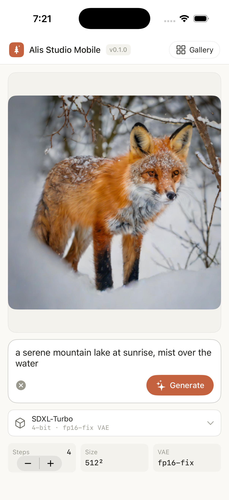
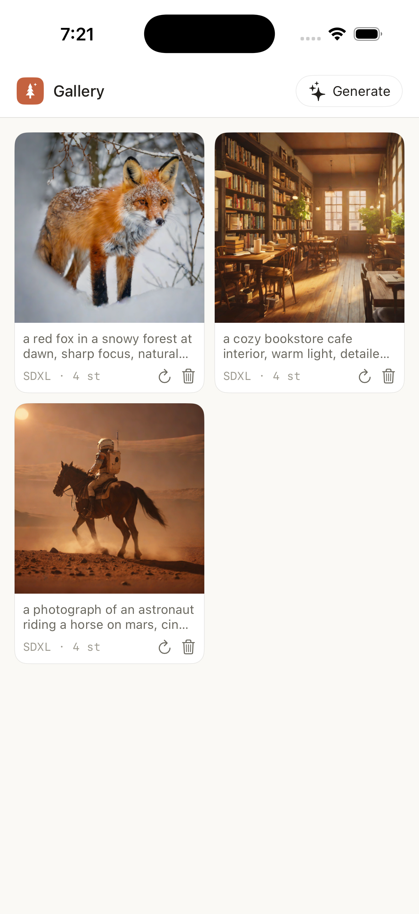

# Alis Studio Mobile

On-device, native image generation for **iPhone** — a SwiftUI app that runs
text-to-image diffusion models entirely on the device with
[MLX Swift](https://github.com/ml-explore/mlx-swift). No cloud, no accounts;
your images never leave the phone.

The mobile sibling of [Alis Studio](https://github.com/avlp12/alis-studio) (the
Mac desktop app), sharing its design language — clay accent, cream surfaces, the
pine mark, light + dark.

| Generate | Gallery |
|---|---|
|  |  |

*Real images generated on an iPhone 16 Pro Max — SDXL-Turbo, 512², 4 steps.*

## Requirements

> [!IMPORTANT]
> **An 8 GB-class iPhone is required.** The app runs a multi-gigabyte diffusion
> model fully in memory; on devices with less than 8 GB of RAM it shows an
> "unsupported device" screen and will not generate (the OS would otherwise
> kill it mid-generation). This is enforced at runtime.

| | Minimum |
|---|---|
| **Device RAM** | **8 GB** — iPhone 15 Pro, 15 Pro Max, 16, 16 Plus, 16 Pro, 16 Pro Max, or newer. **Not supported:** iPhone 15 / 15 Plus (6 GB), SE, and all older models. |
| **iOS** | 17.0 or later |
| **Free storage** | ~8 GB for SDXL-Turbo (≈7 GB weights + ≈0.3 GB fp16-fix VAE), or ~2.5 GB for SD-Turbo. Downloaded once, then cached. |
| **Network** | Required on **first run** to download model weights from Hugging Face. Keep the screen on — the download is several GB and the app is killed if it's suspended mid-download. |
| **Hardware** | A **physical** iPhone. MLX has no Metal backend in the iOS Simulator, so generation only runs on a real device. |

## Models & on-device memory (validated on iPhone 16 Pro Max, 8 GB)

| Model | Config | Peak resident | Latency (512²) | Quality |
|-------|--------|---------------|----------------|---------|
| **SDXL-Turbo** | 4-bit UNet · `sdxl-vae-fp16-fix` · 2–4 steps | **~4.25 GiB** | ~10–13 s/img | highest (photorealistic) |
| **SD-Turbo** | 4-bit UNet · fp16 VAE · 4 steps | **~3.4 GiB** | ~6 s/img | good, fastest |

Both stay well under the 8 GB device's jetsam limit at 512². The memory tuning
came from on-device measurement: the **VAE decode activation is the memory peak**,
so SDXL loads the fp16-stable VAE (the stock SDXL VAE NaNs in fp16); the UNet is
4-bit; and the MLX cache is cleared between generations to stop it accumulating.

## Features

- Prompt → 512² image, fully on-device (MLX Metal)
- Model picker — SDXL-Turbo / SD-Turbo
- Adjustable steps; Stop (cancels mid-generation)
- Gallery — generations saved on device; reuse-prompt / delete
- Light + dark, matching Alis Studio
- Runtime device check (blocks unsupported <8 GB hardware)

## Build

Requires Xcode 16+, an iOS 17+ **device**, and
[XcodeGen](https://github.com/yonaskolb/XcodeGen).

```sh
brew install xcodegen
xcodegen generate          # creates AlisStudioMobile.xcodeproj from project.yml
open AlisStudioMobile.xcodeproj
```

Set your signing Team in the target's Signing & Capabilities, then run on a
physical device. (A free personal team works; the `increased-memory-limit`
entitlement signs fine on it.)

CLI build + install (device id from `xcrun devicectl list devices`):

```sh
xcodegen generate
xcodebuild -project AlisStudioMobile.xcodeproj -scheme AlisStudioMobile \
  -configuration Release -destination 'platform=iOS,id=<DEVICE_ID>' \
  -allowProvisioningUpdates CODE_SIGN_STYLE=Automatic DEVELOPMENT_TEAM=<TEAM_ID> build
xcrun devicectl device install app --device <DEVICE_ID> \
  <DerivedData>/Build/Products/Release-iphoneos/AlisStudioMobile.app
```

On first launch, keep the screen on while the model downloads.

## License

MIT — see [LICENSE](LICENSE). `Sources/StableDiffusion/` is adapted from Apple's
[mlx-swift-examples](https://github.com/ml-explore/mlx-swift-examples) (MIT).
